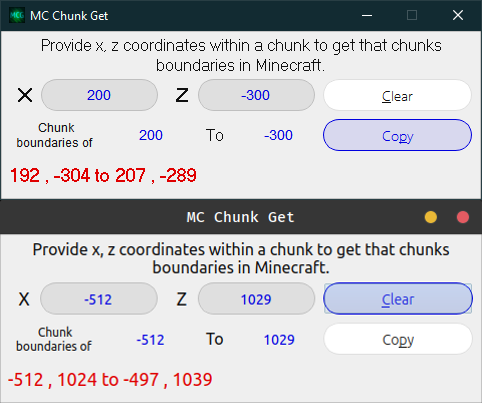

# MC Chunk Get V2

UNDER CONSTRUCTION! - Will be ready soon!

  

 

 

Get coordinate boundaries of a chunk by providing any x, z coordinates inside of that chunk in **Minecraft**.

### Motivation

If you are anything like me you are a perfectionist or truly OCD or both &amp; you like to build everything aligned to chunks if you can or at least symmetrically/relatively positioned even if you don't need to. I built this applcation to help me quickly find the a chunk boundaries coordinates without having to do the math each time. I can do it in my head, but I'm getting old with not enough time that I just don't want to waste.

This application is a *cross platform* **[Python](https://www.python.org/)<sup>[1](#note1)</sup>** rewrite of my **[AutoHotkey](https://www.autohotkey.com/)<sup>[2](#note2)</sup>** GUI that does the exact same thing.

## Usage

Very simple to use, you can run it like any other gui application in your respective operating system.

Provide the X & Z coordinates of any position within a chunk in *Minecraft* &amp; click [Copy] (or Alt+c) to copy the coordinates into your clipboard. This program shows the coordinate pair as soon as you provide both coordinates &amp; will clear if both cooridinates are not provided. You can clear all input with the [Clear] button (or Alt+p).

### Preview (place holder - coming soon)

<span style="text-decoration: line-through;">Quick video preview: [MCG on YouTube]()</span>




## Installation

This is an *open source* project &amp; there are a few ways you can use this; both installable &amp; portable in Windows &amp; portable in Linux for now, but both can be used compiled or from source; your choice.

You can even grab the source project &amp; compile yourself if you know how to do so.

### Windows Install

#### Installer

Download the EXE and MSI file and double click the EXE (or run from cmd).

#### Portable (Compiled)

Download the Compiled Portable/Archive &amp; extract it to wherever you like your portable programs. Run the provided EXE in the main folder to run the program.

### Linux Install

#### Portable (Compiled)

AppImages are easy just download the Linux Compiled AppImage/Portable &amp; place it where you want it &amp; make it executable &amp; run it by either double clicking (or however you have execution set up) or from the shell:

```Bash
$ cd /path/to/AppImage/
$ chmod u+x mc_chunk_get_v2.AppImage # set executable
$ ./mc_chunk_get_v2.AppImage &
```

or

```Bash
$ chmod u+x /path/to/AppImage/mc_chunk_get_v2.AppImage
$ /path/to/AppImage/mc_chunk_get_v2.AppImage &
```

You can change the AppImage's name to whatever you like E.g.: 'mcchunkgetv2' &amp; place it in your $PATH of choice.

### Files

#### Windows

|Type|File Type|File/s|
| --------- | --------- | --------- |
|Installer (Pt1 - used with the file below)    |EXE/Installer|[Placeholder]()|
|Installer (Pt2 - used with the file above)    |MSI/Installer|[Placeholder]()|
|Compiled      |Portable/Archive|[Placeholder]()|
|Source      |Project Files/Archive|[Placeholder]()|

#### Linux

|Type|File Type|File/s|
| --------- | --------- | --------- |
|Compiled      |AppImage/Portable|[MC_Chunk_Get-x86_64.AppImage](./Linux/compiled/MC_Chunk_Get-x86_64.AppImage)|
|Source      |Project Files/Archive|[source_mc_chunk_get.tar.gz](./Linux/src/source_mc_chunk_get.tar.gz)|

#### Mac - Not Available

Sorry, nothing too personal. I don't have a Mac anymore. If someone wants to contribute to this project by maybe forking &amp; compiling in Mac &amp; making a pull request or whatever you want to do really, then by all means, be my guest.

#### Release Page

Or you can get all files &amp; sources for all OSes at the projects release page: [Release]()

### Misc...

|Notes|
| --- |
|<a name="note1"><sup>1: Python - A high level, interpreted programming language.</sup></a>|
|<a name="note2"><sup>2: AutoHotkey - A full featured Windows scripting language with hotkey &amp; gui support &amp; focus on automation.</sup></a>|

This has been tested on both Windows &amp; Linux:

Linux:

```Bash
$ cat /etc/*-release|grep "PRETTY_NAME"|cut -d'=' -f2
"Ubuntu 18.04.4 LTS"
$ uname -a|awk '{print $1" "$3" "$11}'
Linux 5.3.0-7625-generic x86_64
```

Windows:

Windows 10 x86_64 - more to come.


## License

[License File](LICENSE)

>This program is free software: you can redistribute it and/or modify it under the terms of the GNU General Public License as published by the Free Software Foundation, either version 3 of the License, or (at your option) any later version. 

>This program is distributed in the hope that it will be useful, but WITHOUT ANY WARRANTY; without even the implied warranty of MERCHANTABILITY or FITNESS FOR A PARTICULAR PURPOSE.  See the GNU General Public License for more details.
